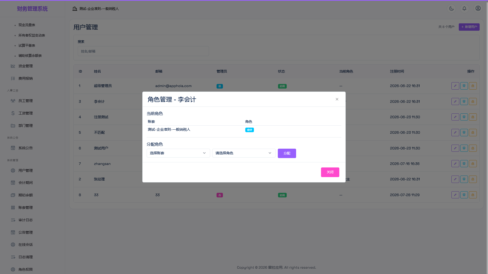

# 03 · 角色与权限

系统采用「**账套 + 角色 + 权限点**」三层模型：用户先在账套内被赋予角色，角色持有一组权限点，菜单与接口都按权限点放行。

---

## 1. 内置角色

| 角色 | 演示账号 | 密码 | 定位 |
|------|---------|------|------|
| 系统管理员 | `admin@apphola.com` | `admin123` | 运维账号，**不受权限点限制**，拥有全部功能 |
| 所有者（owner） | `owner@apphola.com` | `owner123` | 账套负责人，拥有该账套全部业务与系统管理权限 |
| 会计（accountant） | `demo@apphola.com` | `demo123` | 日常记账与业务操作，审批、删除、结账类操作受限 |
| 查看者（viewer） | `viewer@apphola.com` | `viewer123` | 只读角色，仅可查看凭证、科目、报表与审计日志 |

> 上表为首次启动自动创建的演示账号，**生产环境必须修改密码**，并停用不使用的账号（见 [07 快速上手](07-快速上手.md)）。
>
> 系统管理员通过账号上的管理员标记绕过权限校验，用于运维与故障排查；日常业务操作建议使用所有者或会计账号，以便审计日志准确归属到人。

---

## 2. 模块权限矩阵

图例：**✅ 完整** = 查看与全部业务操作；**◐ 受限** = 可查看并新增/编辑，但审批、删除、结账等动作受限；**👁 只读** = 仅可查看；**—** = 菜单不可见、接口拒绝。

| 模块 | 系统管理员 | 所有者 | 会计 | 查看者 |
|------|:---------:|:------:|:----:|:------:|
| 控制台 | ✅ | ✅ | ✅ | ✅ |
| 凭证管理 | ✅ | ✅ | ◐ 可录入/编辑/记账，**不能审核、反记账、删除** | 👁 |
| 会计科目 | ✅ | ✅ | ◐ 可新增/编辑/启停 | 👁 |
| 账簿管理 | ✅ | ✅ | ✅ | ✅ |
| 财务报表 | ✅ | ✅ | ✅ | ✅ |
| 期末处理（会计期间 / 期初余额） | ✅ | ✅ | — | — |
| 固定资产 | ✅ | ✅ | ◐ 可新增/编辑/计提折旧，**不能删除、处置** | — |
| 应收应付 | ✅ | ✅ | — | — |
| 库存管理 | ✅ | ✅ | ✅ | — |
| 币种管理 | ✅ | ✅ | ✅ | — |
| 增值税管理 | ✅ | ✅ | ✅ | — |
| 辅助核算（客户/供应商） | ✅ | ✅ | ✅ | — |
| 项目档案 | ✅ | ✅ | ✅ | — |
| 资金管理 | ✅ | ✅ | ◐ 可新增/编辑账户与流水，**不能删除** | — |
| 费用报销 | ✅ | ✅ | ◐ 可登记/编辑，**不能审批、驳回、删除** | — |
| 员工 / 部门 | ✅ | ✅ | ◐ 可新增/编辑，**不能删除** | — |
| 工资管理 | ✅ | ✅ | ◐ 可录入/编辑，**不能发放、删除** | — |
| 系统公告 | ✅ | ✅ | ✅ | ✅ |
| 用户管理 | ✅ | ✅ | — | — |
| 账套管理 | ✅ | ✅ | — | — |
| 审计日志 | ✅ | ✅ | ✅ | 👁 |
| 公告管理 / 在线会话 / 日志清理 / 角色权限 | ✅ | ✅ | — | — |

---

## 3. 关键差异（最常被问到）

| 问题 | 答案 |
|------|------|
| 谁能审核凭证？ | 管理员、所有者。会计只能录入与记账，审核需所有者操作（体现职责分离） |
| 谁能关账 / 年结？ | 管理员、所有者 |
| 谁能删除凭证？ | 管理员、所有者（且仅限草稿状态） |
| 谁能管用户与角色？ | 管理员、所有者 |
| 谁能看账套设置？ | 管理员、所有者 |
| 只读角色的范围？ | 查看者：凭证、科目、账簿、报表、审计日志可看，其余模块菜单不显示 |

> **双保险**：权限既控制菜单是否显示，也在后端接口层二次校验。即使绕过界面直接调用接口，越权请求同样会被拒绝。

---

## 4. 自定义角色

除三种内置业务角色外，系统支持在「系统管理 → 角色权限」中**新建自定义角色**，按权限点自由组合（例如：只能录入费用、只能查看报表的"出纳"角色），再把账号分配到该角色。

- 内置角色的权限点组合可查看、可调整；
- 新建账号时可指定其在某个账套中的角色；
- 同一用户在不同账套可拥有不同角色（多账套场景下权限相互独立）。

