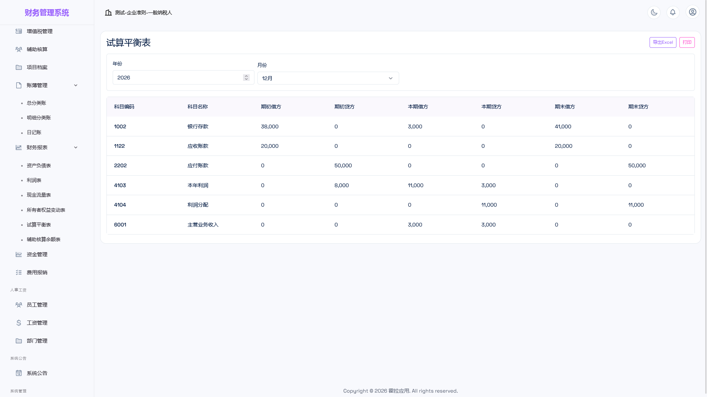

# 07 · 快速上手

> 面向最终用户：拿到系统后先跑通一遍，确认功能与预期一致。

---

## 1. 默认账号

首次启动时系统会自动创建一套演示数据，包含以下账号（登录使用**邮箱 + 密码**）：

| 角色 | 邮箱 | 密码 | 用途 |
|------|------|------|------|
| 系统管理员 | `admin@apphola.com` | `admin123` | 运维与演示，全部功能可用 |
| 所有者 | `owner@apphola.com` | `owner123` | 账套负责人，全部业务与审批权限 |
| 会计 | `demo@apphola.com` | `demo123` | 日常记账（审核、结账等受限） |
| 查看者 | `viewer@apphola.com` | `viewer123` | 只读查看 |

> **生产环境务必修改以上密码**，并停用不需要的账号，「系统管理员」账号仅用于运维排障。

---

## 2. 自动初始化的演示数据

| 内容 | 说明 |
|------|------|
| 演示账套 | 名称为「演示公司」，会计准则：企业会计准则，纳税人类型：一般纳税人 |
| 会计科目 | 按准则内置的科目表（91 个科目），可直接使用或按需调整 |
| 会计期间 | 当年 1–12 月共 12 个期间，初始状态为开启 |
| 本位币 | 人民币（CNY） |
| 部门 | 技术部、财务部、行政部 |

> 演示数据仅用于验收与体验。正式使用时，建议新建自有账套（系统管理 → 账套管理 → 新建账套）并录入期初余额。

---

## 3. 五分钟跑通一遍业务

### ① 登录并认识控制台
用 `admin@apphola.com` / `admin123` 登录，进入控制台查看统计卡片与快捷操作。

### ② 查看会计科目
进入「财务管理 → 会计科目」，按编码或名称搜索，确认演示科目已就绪。

### ③ 录入第一张凭证
进入「凭证管理 → 新增凭证」，例如报销办公费：

| 摘要 | 科目 | 借方 | 贷方 |
|------|------|------|------|
| 购买办公用品 | 管理费用 | 1,000.00 | |
| 购买办公用品 | 银行存款 | | 1,000.00 |

要点：借贷金额必须相等，否则无法保存；凭证号由系统自动生成。

### ④ 审核并记账
在凭证列表点击「审核」→ 状态变为已审核；再点击「记账」→ 状态变为已记账。账簿与报表随即纳入该笔业务。

### ⑤ 查看账簿与报表
- 「账簿管理 → 总分类账」：看科目发生额与余额；
- 「账簿管理 → 日记账」：看逐笔分录明细；
- 「财务报表 → 试算平衡表」：验证借贷平衡；
- 「财务报表 → 资产负债表 / 利润表」：确认报表已取到上述数据。

### ⑥ 体验期末结账（可选）
进入「系统管理 → 会计期间」，对已完账的月份执行关账，观察报表期间自动切换为最近已关账期间。

---

## 4. 正式启用前的建议动作

| 动作 | 位置 |
|------|------|
| 修改所有演示账号密码 | 系统管理 → 用户管理 |
| 停用不再使用的账号 | 系统管理 → 用户管理（停用） |
| 新建自有账套并录入期初余额 | 系统管理 → 账套管理 / 期初余额 |
| 按自身业务调整会计科目 | 财务管理 → 会计科目 |
| 维护客户、供应商、项目等基础档案 | 财务管理 → 辅助核算 / 项目档案 |
| 配置部门与员工 | 人事工资 → 部门管理 / 员工管理 |
| 设定角色与权限（如需自定义） | 系统管理 → 角色权限 |

---

## 5. 下一步

- 角色权限的差异说明：[03 角色与权限](03-角色与权限.md)
- 功能逐项清单：[02 功能总览](02-功能总览.md)
- 升级与备份：[08 升级与备份](08-升级与备份.md)
