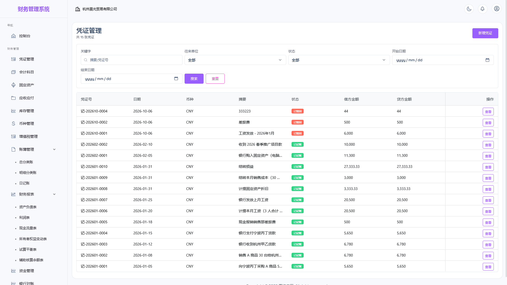
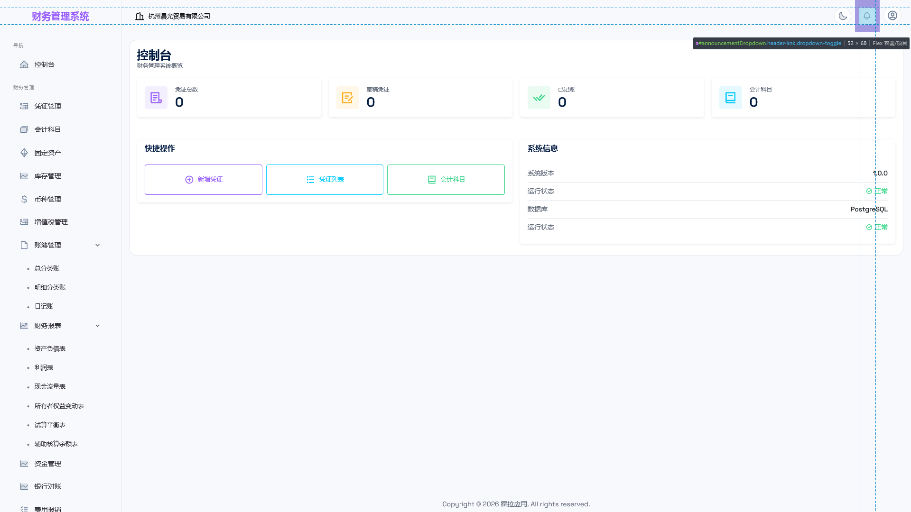
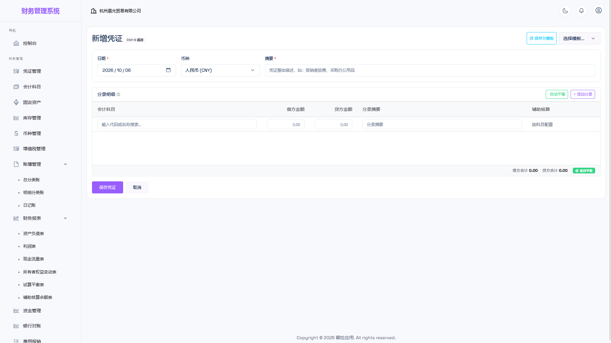
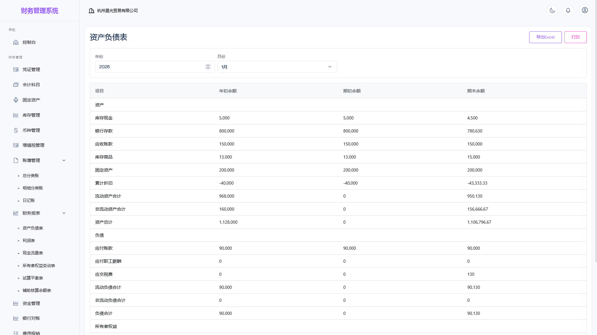

# 霍拉应用 · 财务管理系统

> 面向中小企业的一体化财务管理系统：凭证 → 账簿 → 报表全链路打通，支持多账套、多币种、税务、资产与库存核算。私有化部署，数据完全自主。

| | |
|---|---|
| 当前版本 | 1.0.2 |
| 产品官网 | <https://apps-hub.apphola.com/> |
| 文档中心 | <https://docs.apphola.com/> |
| 授权方式 | 商业软件（闭源），按许可交付 |

## 为什么选择霍拉财务

- **一套账、一条链路**：凭证 → 账簿 → 报表，数据一次录入全程复用，报表实时取数。
- **私有化交付**：部署在您自己的服务器上，账套数据、附件与审计日志全部留在本地，不依赖第三方 SaaS。
- **开箱即用**：内置符合中国企业会计准则的科目模板、会计期间与币种，首次启动即可开始记账。
- **可运维**：Docker 与 JAR 两种部署形态，数据库结构随版本自动升级，支持备份与回滚。

## 核心能力

1. **完整会计循环**：建账 → 期初余额 → 日常凭证 → 审核 → 记账 → 期末结转 → 关账/年结。
2. **规范的账簿与报表**：总分类账、明细分类账、日记账；资产负债表、利润表、现金流量表、所有者权益变动表、试算平衡表、辅助核算余额表，支持导出 Excel 与打印。
3. **多维辅助核算**：客户、供应商、部门、员工、项目五个维度，凭证分录可按维度挂接，账簿与余额表可按维度过滤。
4. **业务模块联动**：应收应付与核销、固定资产与折旧、库存与仓库、费用报销与审批、工资与发放、资金管理与银行对账。
5. **多账套与多币种**：一套系统管理多个账套；本位币 + 外币、外币兑换与期末汇兑调整。
6. **精细的权限体系**：企业主 / 会计 / 查看者三种内置角色 + 自定义角色，权限点级控制，菜单与接口双重校验。
7. **增值税管理**：按纳税人类型（一般纳税人 / 小规模）自动汇总销项、进项与应纳税额。

## 功能总览

| 分组 | 模块 |
|------|------|
| 财务管理 | 凭证管理、会计科目、账簿管理、财务报表、固定资产、应收应付、库存管理、币种管理、增值税管理、客户档案、供应商档案、项目档案、资金管理、费用报销 |
| 人事工资 | 员工管理、工资管理、部门管理 |
| 系统公告 | 公告列表 |
| 系统管理 | 用户管理、会计期间、期初余额、账套管理、审计日志、公告管理、在线会话、日志清理、角色权限 |

## 角色与权限

「**账套 + 角色 + 权限点**」三层模型：用户在账套内被赋予角色，角色持有一组权限点，菜单与接口双重放行。除内置角色外，可在「系统管理 → 角色权限」**新建自定义角色**按权限点自由组合，并为用户设置数据权限；同一用户在不同账套可拥有不同角色。

图例：**✅ 完整** ／ **◐ 受限**（查看与新增/编辑，审批、删除、结账等受限）／ **👁 只读** ／ **—** 不可见且接口拒绝。

| 模块 | 企业主 | 会计 | 查看者 |
|------|:------:|:----:|:------:|
| 凭证管理 | ✅ | ◐ 不可审核、反记账、删除 | 👁 |
| 会计科目 | ✅ | ◐ 不可删除 | 👁 |
| 账簿 / 报表 | ✅ | ✅ | ✅ |
| 期末处理（期间 / 期初余额） | ✅ | — | — |
| 固定资产 | ✅ | ◐ 不可删除、处置 | — |
| 应收应付 | ✅ | — | — |
| 库存 / 币种 / 增值税 | ✅ | ✅ | — |
| 客户 / 供应商 / 项目档案 | ✅ | ✅ | — |
| 资金管理（含银行对账） | ✅ | ◐ 不可删除账户与流水 | — |
| 费用报销 | ✅ | ◐ 不可审批、驳回、删除 | — |
| 员工 / 部门 / 工资 | ✅ | ◐ 不可删除 / 发放 | — |
| 用户管理 / 账套管理 / 角色权限 | ✅ | — | — |

关键差异：**审核凭证、关账/年结、删除凭证、管用户与角色**均需企业主及以上（职责分离）。系统管理员不受权限点限制。

## 快速上手

首次启动自带演示账套「演示公司」（企业会计准则 · 一般纳税人）与 4 个演示账号，五分钟跑通一遍业务：

1. **登录**：`admin@apphola.com` / `admin123`，进入控制台。
2. **查看科目**：「财务管理 → 会计科目」，确认演示科目就绪。
3. **录入第一张凭证**：「凭证管理 → 新增凭证」，例如购买办公用品 1,000 元：借 管理费用 1,000 / 贷 银行存款 1,000。借贷不平无法保存。
4. **审核并记账**：列表中「审核」→「记账」，账簿与报表随即纳入该笔业务。
5. **查看报表**：总分类账、日记账、试算平衡表、资产负债表 / 利润表。

正式启用前：修改演示账号密码、新建自有账套并录入期初余额、按业务调整科目与基础档案。

## 下载与部署

- **下载**：前往本仓库 [Releases](../../releases) 页面，获取最新版本的发布包（Docker 镜像包 / 传统部署包）。
- **部署**：Docker 一条命令启动；详细的配置参数、上线检查与升级备份说明，请参阅[文档中心](https://docs.apphola.com/)。

## 版权与支持

- 本产品为**商业软件**，未经授权不得复制、分发、反编译或用于二次销售。
- 使用中遇到问题，请通过 [产品官网](https://apps-hub.apphola.com/) 或 [文档中心](https://docs.apphola.com/) 获取支持。

© Apphola. All rights reserved.
