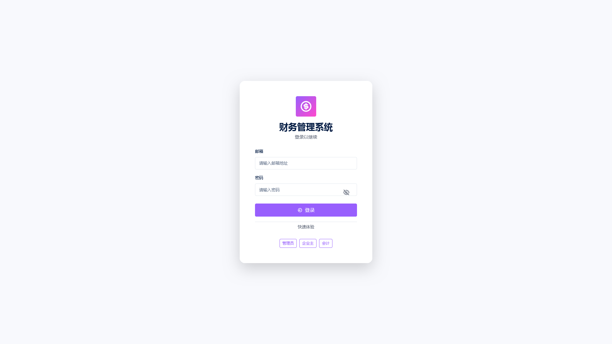

# 部署指南

> 目标：按本文操作后，能在自己的服务器上打开系统并登录成功。全程约 10 分钟。配置参数与上线检查也包含在本文内。

---

## 1. 选择部署方式

| | Docker 本地镜像（推荐） | 传统 JAR + Nginx |
|---|---|---|
| 服务器需要 | Docker Engine 20.10+ | JDK 17+、Nginx |
| 需要单独部署前端 | 不需要（已打入镜像） | 需要（解压静态包给 Nginx 托管） |
| 升级方式 | 换镜像包后重跑启动脚本 | 替换 JAR 与静态文件 |
| 适合 | 希望快速上线、便于回滚 | 已有 Nginx 与统一运维体系 |

## 2. 环境要求

| 组件 | 要求 | 说明 |
|------|------|------|
| 操作系统 | Linux（推荐）/ Windows Server | 有 Docker 或 JDK 即可 |
| Docker Engine | 20.10+ | 选择 Docker 方式时必需 |
| JDK | 17+ | 选择 JAR 方式时必需 |
| PostgreSQL | 14+（推荐 17） | 可装在宿主机，也可单独用容器运行 |
| 内存 / 磁盘 | ≥ 2 GB / 按业务量预留 | 附件与日志会随使用增长 |
| 端口 | 10010（可改） | 对外需可访问 |

## 3. 准备数据库

在 PostgreSQL 上创建库与账号（Flyway 会自动建表，无需执行任何建表 SQL）：

```sql
CREATE DATABASE fms ENCODE 'UTF8';
CREATE USER fms WITH PASSWORD '请替换为强密码';
GRANT ALL PRIVILEGES ON DATABASE fms TO fms;
-- 迁移脚本需要在 public schema 建表
\c fms
GRANT ALL ON SCHEMA public TO fms;
```

> 数据库字符集请使用 UTF8，避免中文摘要、科目名称出现乱码。

---

## 4. 方式 A：Docker 本地镜像部署（推荐）

### 4.1 部署包内容

| 文件 | 说明 |
|------|------|
| `fms-image.tar` | 应用镜像（含后端与前端产物），本地导入，无需镜像仓库 |
| `fms.env` | 运行环境变量：数据库连接与 JWT 密钥，**首次部署必须修改** |
| `docker-run.sh` / `docker-run.bat` | Linux / Windows 启动脚本 |

### 4.2 步骤

**① 上传并解压**到服务器任意目录，例如 `/opt/fms`。

**② 编辑 `fms.env`**，至少修改以下三项：

```ini
APP_PROFILE=prod

# 数据库：把 DB_HOST 换成 PostgreSQL 的地址
DB_URL=jdbc:postgresql://DB_HOST:5432/fms
DB_USERNAME=fms
DB_PASSWORD=请替换为强密码

# JWT 签名密钥：必须修改，至少 32 字节，建议 64 位以上随机串
JWT_SECRET=请替换为随机密钥
```

生成随机密钥（任选其一）：`openssl rand -base64 48` 或 `head -c 48 /dev/urandom | base64`。

**③ （可选）调整对外端口**：编辑脚本中的 `HOST_PORT`（默认 10010）。

**④ 启动**：`chmod +x docker-run.sh && ./docker-run.sh`（Windows 执行 `docker-run.bat`）。脚本自动完成：本地无镜像则导入 `fms-image.tar` → 删除同名旧容器 → 以新镜像启动容器 `fms`（开机自启）。

**⑤ 验证**：浏览器访问 `http://<服务器IP>:10010`，出现登录页即成功。

> ⚠️ 请勿绕过脚本直接 `docker run`：不带 `--env-file fms.env` 时数据库密码与 JWT 密钥缺失，应用会以 `Could not resolve placeholder 'JWT_SECRET'` 启动失败。

容器说明：容器名 `fms`；容器内端口 10010；上传目录 `/app/uploads` 挂载到数据卷 `fms-uploads`（删除容器不丢附件）；日志 `docker logs -f fms`。

---

## 5. 方式 B：传统 JAR + Nginx 部署

### 5.1 部署包内容

| 文件 | 说明 |
|------|------|
| `fms-backend.jar` | 后端程序（已混淆，自带内嵌 Web 容器） |
| `frontend-dist.zip` | 前端静态文件（解压后 `index.html` 在根目录） |
| `application-prod.properties` | 生产配置模板，**首次部署必须修改** |
| `start.sh` / `start.bat` | 后端启动脚本（Linux / Windows） |

### 5.2 配置并启动后端

编辑 `application-prod.properties`：

```properties
server.port=10010
spring.datasource.url=jdbc:postgresql://localhost:5432/fms
spring.datasource.username=fms
spring.datasource.password=请替换为强密码
jwt.secret=请替换为随机密钥
jwt.expiration=86400000
```

启动：`./start.sh`（Windows 执行 `start.bat`）。首次启动会自动执行数据库迁移并初始化演示数据。

### 5.3 部署前端

解压 `frontend-dist.zip` 到 Nginx 站点目录，参考配置：

```nginx
server {
    listen 80;
    server_name your-domain.com;

    root /path/to/frontend-dist;
    index index.html;

    # SPA 路由回退，避免刷新页面 404
    location / {
        try_files $uri $uri/ /index.html;
    }

    location /api/ {
        proxy_pass http://127.0.0.1:10010;
        proxy_set_header Host $host;
        proxy_set_header X-Real-IP $remote_addr;
    }

    location /uploads/ {
        proxy_pass http://127.0.0.1:10010;
    }
}
```

---

## 6. 配置参数

全部运行参数通过**环境变量**注入（Docker 走 `fms.env`，JAR 走 `application-prod.properties`），无需改动程序包。

### 6.1 必填参数

| 参数 | 说明 |
|------|------|
| `DB_URL` | 数据库连接串，如 `jdbc:postgresql://10.0.0.5:5432/fms` |
| `DB_PASSWORD` | 数据库密码 |
| `JWT_SECRET` | 令牌签名密钥，**至少 32 字节**，建议 64 位以上随机字符串 |

> `JWT_SECRET` 变更后此前签发的令牌立即失效，用户需重新登录（更换密钥也是应急强制下线的有效手段）。

### 6.2 可选参数

| 参数 | 默认值 | 说明 |
|------|--------|------|
| `DB_USERNAME` | `postgres` | 数据库用户名 |
| `DB_POOL_MAX` / `DB_POOL_MIN` | `30` / `10`（prod） | 连接池上下限 |
| `APP_PROFILE` | `dev` | 运行环境标识，**生产固定 `prod`** |
| `APP_PORT` | `10010` | 应用监听端口（容器内端口） |
| `JWT_EXPIRATION` | `86400000` | 令牌有效期（毫秒），默认 24 小时 |
| `app.upload-dir` | `./uploads` | 附件存储目录；容器内保持 `/app/uploads` 并挂载持久化卷 |

### 6.3 环境差异（profile）

| 配置项 | 开发（dev） | 生产（prod） |
|--------|------------|-------------|
| 数据库迁移校验 | 关闭（容错） | **开启**：迁移历史与脚本不一致时启动失败 |
| SQL 日志 | 控制台输出 | 按日志框架级别输出 |
| 应用日志级别 | 较详细 | 业务 INFO，框架 WARN |

> **生产环境请勿手工修改数据库表结构**：迁移历史与脚本不一致时应用会拒绝启动。结构变更请通过版本升级由迁移脚本完成。

### 6.4 调优建议

| 场景 | 建议 |
|------|------|
| 并发较多、报表偏慢 | 提高 `DB_POOL_MAX`（不超过 PostgreSQL `max_connections` 的 70%） |
| 磁盘增长过快 | 定期清理日志（系统管理 → 日志清理），为 `uploads` 单独规划容量 |
| 强制所有用户重新登录 | 更换 `JWT_SECRET` 并重启 |
| 服务器时间 | 保证时区正确（影响会计期间与凭证日期） |

---

## 7. 部署后验证

| 检查项 | 期望结果 |
|--------|---------|
| 打开首页 | 出现登录页（不是 404、不是空白） |
| 使用 `admin@apphola.com` / `admin123` 登录 | 进入控制台，看到统计卡片 |
| 打开「财务报表 → 试算平衡表」 | 页面正常返回，无报错 |
| 「凭证管理 → 新增凭证」 | 借贷不平衡时无法保存 |
| 上传一个附件到凭证 | 附件可上传并下载 |



---

## 8. 上线前检查清单

- [ ] 数据库密码、JWT 密钥已改为强随机值
- [ ] 四个演示账号的密码已修改，未使用的账号已停用
- [ ] 演示账套数据已清理或已重建自有账套并录入期初余额
- [ ] 数据库、`uploads` 目录已纳入备份计划（见 [升级与备份](升级与备份.md)）
- [ ] 防火墙仅开放必要端口；对外访问已配置 HTTPS
- [ ] 服务器时间与时区正确（影响会计期间与凭证日期）
